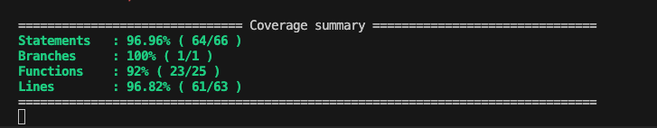

# prueba técnica pluriza - angular dev

Esta prueba es un dashboard simple desarrollado en Angular que muestra datos de usuarios obtenidos de una API RESTful. Incluye funcionalidades como búsqueda y paginación de usuarios.
›
## Instalación

1. Clona el repositorio desde GitHub:

   ```bash
   git clone https://github.com/majiar15/pluriza.git
   ```
2. Instala las dependencias:
    ```bash
    cd pluriza
    npm install
    ```

## Uso Básico

1. Inicia la aplicación:
    ```bash
    ng serve
    ```
2. Abre tu navegador y visita http://localhost:4200/.

### Testing
1. Para ejecutar pruebas unitarias:
    ```bash
    ng test
    ```

2. cobertura de testing de la app:
    

